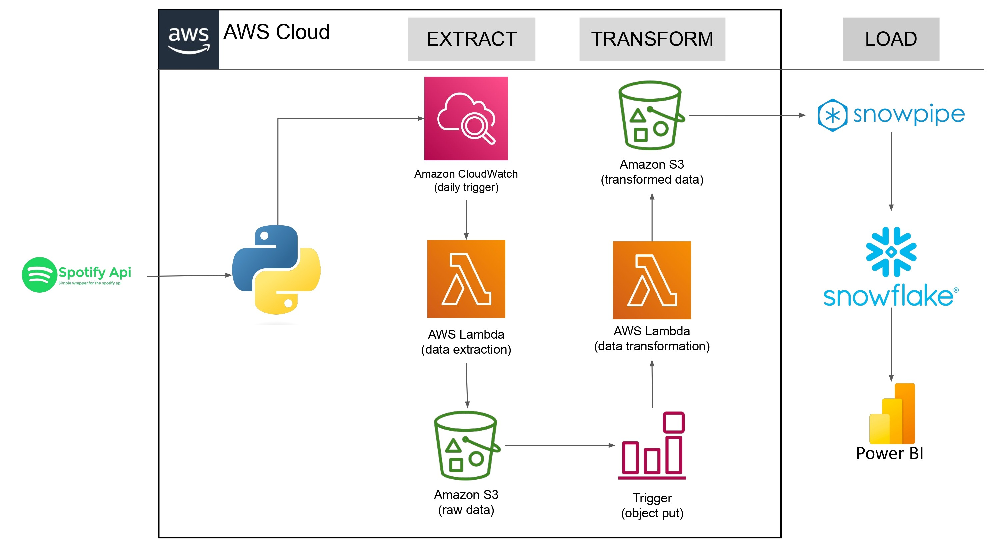

# Spotify Data Pipeline — AWS & Snowflake ETL Project

An end-to-end serverless data pipeline that extracts data from the Spotify API, transforms it using AWS Lambda, and loads it into Snowflake via Snowpipe for real-time analytics in Power BI — fully automated on AWS Cloud.

## Architecture

## Pipeline Flow

1. **Extract** — Amazon CloudWatch triggers an AWS Lambda function daily to fetch playlist track data from the Spotify API using Python
2. **Raw Storage** — Extracted data is stored in Amazon S3 (raw data bucket)
3. **Transform** — An S3 object-put trigger fires a second AWS Lambda function to clean and enrich the data
4. **Transformed Storage** — Transformed data lands in a second Amazon S3 bucket
5. **Load** — Snowpipe automatically ingests data from S3 into Snowflake in near real-time
6. **Analyze** — Power BI connects to Snowflake for dashboard analytics and reporting

## Tech Stack

| Layer | Technology |
|---|---|
| Data Source | Spotify API (Python) |
| Orchestration | Amazon CloudWatch (daily schedule) |
| Extraction | AWS Lambda (Python) |
| Transformation | AWS Lambda (Python) |
| Raw Storage | Amazon S3 |
| Ingestion | Snowpipe (auto-ingest) |
| Data Warehouse | Snowflake |
| Analytics | Power BI |

## Key Learnings

- Serverless ETL architecture using AWS Lambda and S3 event triggers
- Real-time data ingestion with Snowpipe auto-ingest from Amazon S3
- Cloud data warehousing with Snowflake and Power BI dashboards

## Author

**Ahmer Aftab** — [LinkedIn](https://linkedin.com/in/ahmer-aftab-945885115) · [GitHub](https://github.com/ahmeraftab)